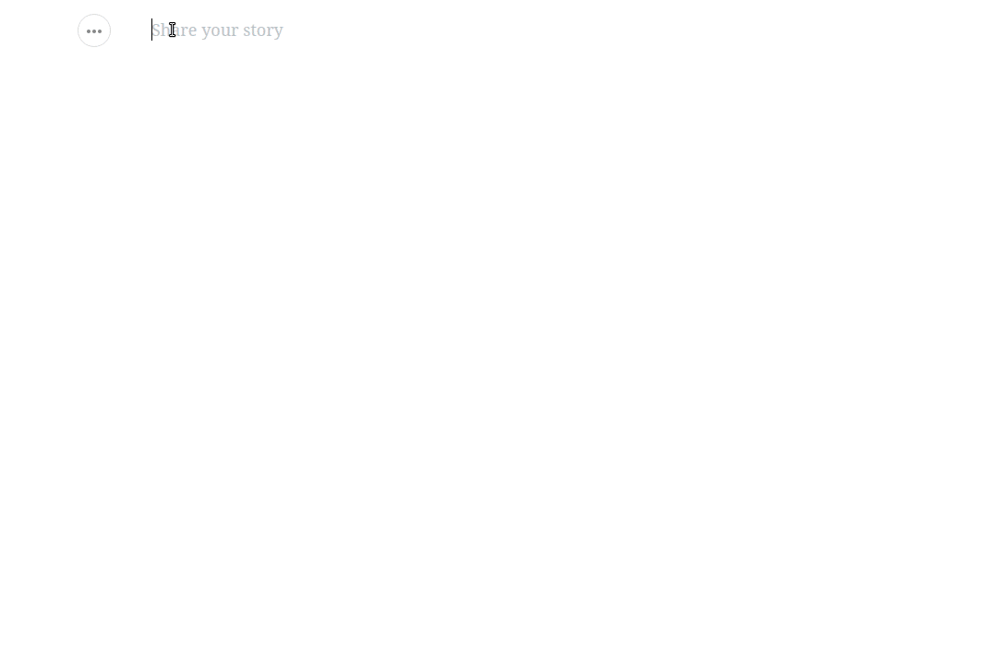

# draft-js-unsplash-plugin
Add Unsplash images in your draft-js editor.

*This is a plugin for `draft-js-plugins-editor`.*



## Installation

```
npm install @jimmycode/draft-js-unsplash-plugin
```

## Usage

```js
import createUnsplashPlugin from '@jimmycode/draft-js-unsplash-plugin';
const unsplashPlugin = createUnsplashPlugin({
  options: {
    accessKey: 'my-access-key'
  }
});
const { UnsplashButton } = unsplashPlugin;
```

## Configuration

| Param             | Default                             | Description                                                       |
|-------------------|-------------------------------------|-------------------------------------------------------------------|
| theme             | Default styles                      | @jimmycode/draft-js-unsplash-plugin/lib/plugin.css                |
| options           | Default behavior                    | List of options.                                                  |
| explorerType      | 'draft-js-unsplash-plugin-explorer' | Type of entity created when inserting the explorer block.         |
| unsplashType      | 'unsplash'                          | Type of entity created when inserting the image.                  |
| descorator        | -                                   | Empty decorator that returns the same component. (No decorations) |
| unsplashComponent | Default implementation              | Provide your own implementation to show the image.                |
| editable          | false                               | This plugin doesn't support the edition of the title in the image. If you want this functionality you must customize the component `unsplashComponent`. The `editable` parameter indicates whether block editing is allowed without having to rewrite the function `blockRendererFn`. | 

### Options

| Option      | Default                                    | Description                                                                                                                                                         |
|-------------|--------------------------------------------|---------------------------------------------------------------------------------------------------------------------------------------------------------------------|
| accessKey   | (Required)                                 | Unsplash Access Key. (https://unsplash.com/oauth/applications)                                                                                                      |
| placehoder  | 'Type to search Unsplash, and press Enter' | Text as placeholder for the Explorer.                                                                                                                               |
| perPage     | 9                                          | Number of images to show in each page of results.                                                                                                                   |
| onRequest   | `return (await fetch(url)).json()`         | Function to perform the request. It will receive the URL to request and MUST return a JSON.                                                                         |
| getMetadata | -                                          | Function to determine the metadata inserted along with the image selected. It MUST return an object with at least the following keys: - src - width - height - user |

## Theming
The plugin ships with a default styling available at this location in the installed package: `node_modules/@jimmycode/draft-js-unsplash-plugin/lib/plugin.css`

*Webpack Usage*
1.  Install Webpack loaders: `npm i style-loader css-loader --save-dev`
2.  Add the below section to Webpack config (if your config already has a loaders array, simply add the below loader object to your existing list.

```js
module.exports = {
  module: {
    loaders: [
      {
        test: /plugin\.css$/,
        loaders: [
          'style-loader', 'css',
        ]
      }
    ]
  }
};
``` 

3.  Add the below import line to your component to tell Webpack to inject the style to your component.


```js
import '@jimmycode/draft-js-unsplash-plugin/lib/plugin.css';
```

## Example

```js
import React from 'react';
import ReactDOM from 'react-dom';

import Editor from 'draft-js-plugins-editor';
import { EditorState } from 'draft-js';
import createSideToolbarPlugin from 'draft-js-side-toolbar-plugin';
import BlockTypeSelect from 'draft-js-side-toolbar-plugin/lib/components/BlockTypeSelect';
import createUnsplashPlugin from '@jimmycode/draft-js-unsplash-plugin';

import 'draft-js-side-toolbar-plugin/lib/plugin.css';
import '@jimmycode/draft-js-unsplash-plugin/lib/plugin.css';

const unsplashPlugin = createUnsplashPlugin({
  unsplashPlugin: {
    accessKey: '<my-access-key>'
  }
});
const DefaultBlockTypeSelect = ({ getEditorState, setEditorState, theme }) => (
  <BlockTypeSelect
    getEditorState={getEditorState}
    setEditorState={setEditorState}
    theme={theme}
    structure={[
      unsplashPlugin.UnsplashButton
    ]}
  />
);
const sideToolbarPlugin = createSideToolbarPlugin({
  structure: [DefaultBlockTypeSelect],
});
const { SideToolbar } = sideToolbarPlugin;

class MyEditor extends React.Component {
  constructor(props) {
    super(props);
    this.state = {
      editorState: EditorState.createEmpty()
    };
    this.plugins = [
      sideToolbarPlugin,
      unsplashPlugin
    ];
  }
  
  onChange = (editorState) => {
    this.setState({ editorState });
  }

  render() {
    return (
      <div className="editor">
        <Editor
            editorState={this.state.editorState}
            onChange={this.onChange}
            plugins={this.plugins}
            placeholder="Tell a story" />
        <SideToolbar />
      </div>
    );
  }
}

ReactDOM.render(<MyEditor />, document.getElementById('root'));
```

## Integration
#### With other plugins
In this example you can see how integrate the plugin with `draft-js-focus-plugin` and `draft-js-alignment-plugin`. 

```js
import React from 'react';
import ReactDOM from 'react-dom';

import Editor, { composeDecorators } from 'draft-js-plugins-editor';
import { EditorState } from 'draft-js';
import createSideToolbarPlugin from 'draft-js-side-toolbar-plugin';
import BlockTypeSelect from 'draft-js-side-toolbar-plugin/lib/components/BlockTypeSelect';

import createResizeablePlugin from 'draft-js-resizeable-plugin';
import createAlignmentPlugin from 'draft-js-alignment-plugin';
import createFocusPlugin from 'draft-js-focus-plugin';
import createUnsplashPlugin from '@jimmycode/draft-js-unsplash-plugin';

import 'draft-js-side-toolbar-plugin/lib/plugin.css';
import 'draft-js-alignment-plugin/lib/plugin.css';
import 'draft-js-focus-plugin/lib/plugin.css';
import '@jimmycode/draft-js-unsplash-plugin/lib/plugin.css';

const focusPlugin = createFocusPlugin();
const resizeablePlugin = createResizeablePlugin();
const alignmentPlugin = createAlignmentPlugin();
const { AlignmentTool } = alignmentPlugin;
const decorator = composeDecorators(
  focusPlugin.decorator,
  resizeablePlugin.decorator,
  alignmentPlugin.decorator
);

const unsplashPlugin = createUnsplashPlugin({
  decorator,
  unsplashPlugin: {
    accessKey: '<my-access-key>'
  }
});
const DefaultBlockTypeSelect = ({ getEditorState, setEditorState, theme }) => (
  <BlockTypeSelect
    getEditorState={getEditorState}
    setEditorState={setEditorState}
    theme={theme}
    structure={[
      unsplashPlugin.UnsplashButton
    ]}
  />
);
const sideToolbarPlugin = createSideToolbarPlugin({
  structure: [DefaultBlockTypeSelect],
});
const { SideToolbar } = sideToolbarPlugin;

class MyEditor extends React.Component {
  constructor(props) {
    super(props);

    this.state = {
      editorState: EditorState.createEmpty()
    };

    this.plugins = [
      sideToolbarPlugin,
      focusPlugin,
      resizeablePlugin,
      alignmentPlugin,      
      unsplashPlugin
    ];
  }

  onChange = (editorState) => {
    this.setState({ editorState });
  }

  render() {
    const { editorState } = this.state;

    return (
      <div className='App'>
        <div className='intro' onClick={this.focus}>
          <div className='editor'>
            <Editor
              editorState={editorState}
              onChange={this.onChange}
              plugins={this.plugins}
              placeholder="Share your story" />

            <SideToolbar />
            <AlignmentTool />
          </div>
        </div>
      </div>
    );
  }
}

ReactDOM.render(<MyEditor />, document.getElementById('root'));

```

In this other example you can see how integrate the plugin with `draft-js-image-plugin`.

```js
// npm install --save draft-js-image-plugin

import createImagePlugin from 'draft-js-image-plugin';

const imagePlugin = createImagePlugin();
const unsplashPlugin = createUnsplashPlugin({
  options: {
    accessKey: '<my-access-key>'
  },
  unsplashType: 'IMAGE'   // <- Inserting with this BLOCK TYPE
});

const plugins = [
  sideToolbarPlugin,
  unsplashPlugin,
  imagePlugin  // <- Must go AFTER unsplashPlugin.
];

<Editor
  editorState={editorState}
  onChange={this.onChange}
  plugins={plugins}
  placeholder="Share your story" />
```

#### Axios
See how to provide your own implementation to fetch the URL.
`onRequest` Must return a `Promise` that resolves to a JSON with the metadata.

```js
// npm install axios --save
import axios from 'axios';

const unsplashPlugin = createUnsplashPlugin({
  options: {
    accessKey: '<my-access-key>',
    onRequest: (url) => {
      return axios.get(url).then(res => res.data);
    }
  }
});
```

# Acknowledge
* Icon by: https://www.iconfinder.com/icons/115759/camera_icon
